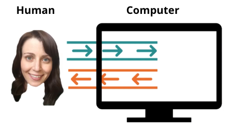
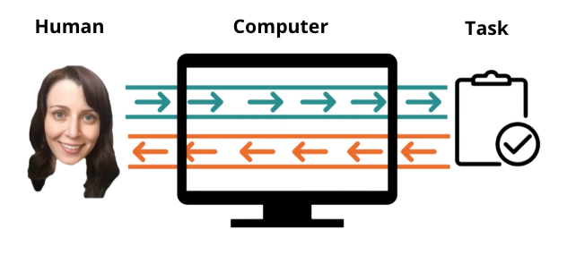
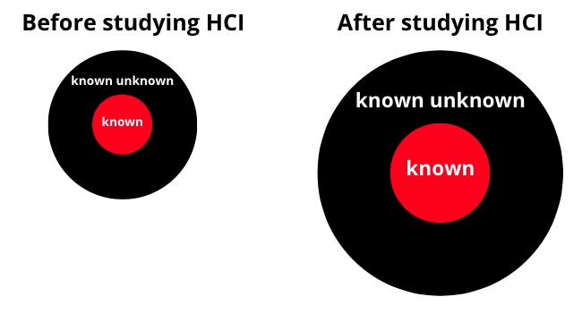
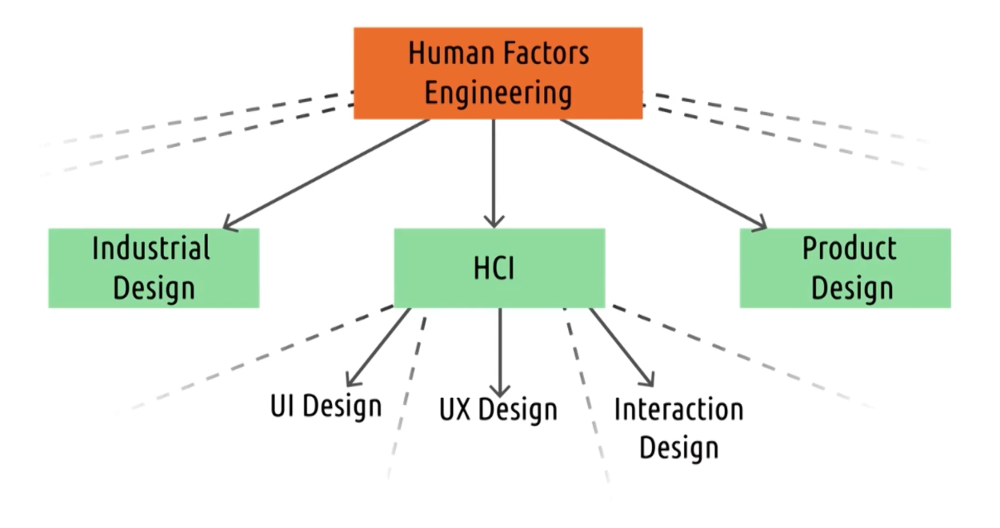
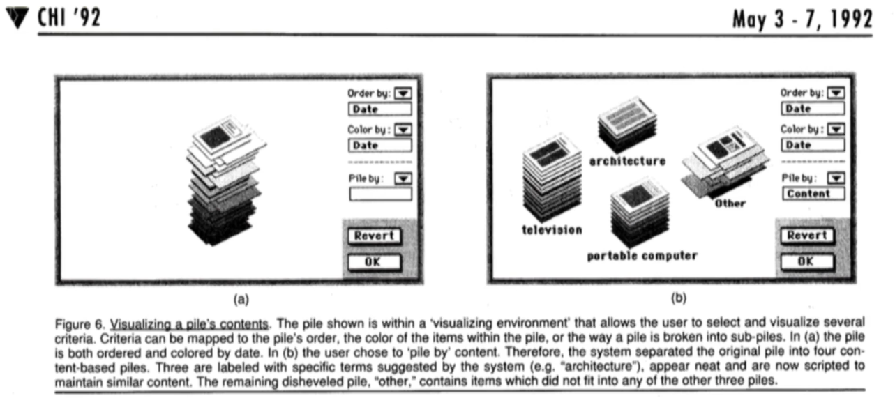
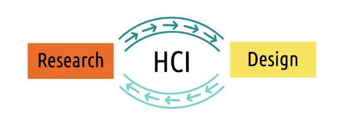

# 1.1 Introduction to HCI

## Humans

Humans have senses like

- sight
- touch
- hearing
- taste
- smell

Humans also have

- memories
- experiences
- skills
- knowledge

In human computer interaction, we take into consideration every element of the human. The way they perceive and interact with the world, as well as their previous experiences with computers and technology.

## Computers

Sometimes we use the word **computer** to mean desktop computers, but in this course all of the following are also computers -

- laptops
- tablets
- smart phones
- smart watches
- cameras
- window switches on a car
- video game controllers
- electronic toys for children

## Interaction

We are interested in the interactions between humans and computers. The most obvious way to view the interaction is that the human interacts with the computer, and the computer responds, thereby interacting with the human.

A more interesting way to view this is that the human interacts with a task through the computer. The interaction is really between a human and a task, the computer in the middle mediates this interaction.

Ideally, we are interested in making the interface as invisible as possible so the user doesn't have to think about the interface and gets to spend their time thinking about the task.

## Reflections

Take a moment and reflect on some of the tasks you do each day involving computers. Try to think of

1. An example where you spend most of your time thinking about the task.
2. An example where you spend most of your time thinking about the tool.

Examples from lectures -

1. **Time is spent on task:** In video games we often forget entirely about the controller and we only think about playing the game. The player has to learn how to use the controls, but as they learn the controls they don't have to think about them any more.
2. **Time is spent on tool:** Sometimes you will have multiple remote controls for a single television, each controlling different parts of the system. Which controller does what? What do all these buttons mean?

## The HCI Space

Computers are all around us and we interact with them every day, so we think we are experts at human computer interaction (HCI). **We are not.** Just because we are experts at interacting with computers doesn't mean we are good at designing interactions between other humans and computers.

Before we study HCI we know some things, and we know that we don't know some things.

After we study HCI we know more things, but we know that there is much more to learn than we thought before.

## HCI in the Big Picture

There are PhD programs in HCI, there are many things to study. Let's look at where HCI sits in a broader hierarchy of fields -

- Human factors engineering is a broader field, they aren't just interested in computers.
- There are sub disciplines within HCI.

## HCI vs. Human Factors

Human factors is interested in designing interactions between people and products, systems or devices. A computer is a type of device, but not all devices are computers, therefore **human factors is a broader field**.

Take an electric car for example. From an HCI perspective we might be interested in visualizing data on the dashboard, or how the radio works. Human factors is not only interested in the computerized parts, but also things like the height of the steering wheel.

Everything is starting to have computers inside of it, even [shower heads](https://gethai.com/). As computers become more common, HCI becomes a larger field of study.

## HCI vs. User Interface Design

For many years the focus of HCI was user interface design. Early innovations like the [light pen](https://en.wikipedia.org/wiki/Light_pen), the [first computer mouse](https://en.wikipedia.org/wiki/Computer_mouse#Engelbart's_first_%22mouse%22), and the first [rollerball mouse](https://en.wikipedia.org/wiki/Computer_mouse#First_rolling-ball_mouse) helped us interact with the screen.

We developed principles for how to display things on the screen too. We borrowed from the magazine and print industry and used displays to help guide our eyes -

We developed techniques for displaying on different screen sizes.

The focus of most UI courses is interactions with a screen, in HCI we go beyond this.

## HCI vs. User Experience Design (UX Design)

HCI and UX Design are closely related, people do not agree on the differences between the two.

In this course we take the view that HCI is about understanding the interactions between humans and computers. User experience design is
about dictating the interactions between users and computers.

Practitioners of HCI have some understanding which gets implemented by practitioners of UX design. We evaluate these designs, and then use this to deepen our understanding of HCI.

- If we create a good design with our understanding, then our understanding is good.
- If we create a bad design with our understanding, then our understanding is bad and we learned something new.

In design-based research we use the results of our designs to conduct research.

This is an example of a feedback cycle, a common theme throughout this course and the world in general.

## HCI vs. Psychology

Human factors engineering is a merger of engineering and psychology, along with other fields like design and cognitive science.

In HCI the engineering is software engineering. There is still a connection to psychology, we use our understanding of psychology to inform the way we design interfaces.

We then use our understanding of those interfaces to reflect on our understanding of psychology. At GA Tech, HCI is cross-listed as both a computer science and a psychology course.

**Example from apple:**

In 1992 psychologists working at Apple studied how people organize information in their workspaces.

They observed that people tended to form piles of material, like a less formal file system. They then designed an interface that was like these piles of paper people had at work.

They then had a better understanding of the thought processes of their users, as well as an interface. Designing the interface helped them understand the psychology of their users.

## HCI Research and Design

HCI involves both research and design.

- Research
  - needfinding
  - prototyping
  - evaluation
- Design (don't worry if you don't know these)
  - Distributed cognition
  - Mental models
  - Universal design

In HCI, research and design are related by a feedback loop.

- Our research informs the designs we construct.
- Results from our designs inform our ongoing research.

## Welcome to HCI

Your professor David Joyner is very excited to teach this course. He hopes it is a well designed course.

